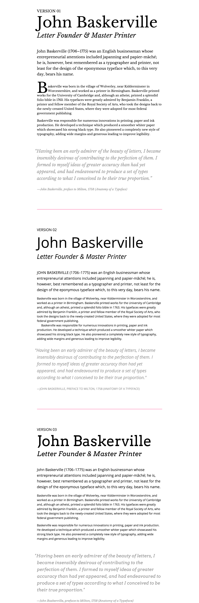

# Baskerville-CSS

We where given an task in week 10 to create 3 different styles on one portion of Baskerville text.

You can view the project
[Version1](https://github.com/NathanPatton/Baskerville-CSS/index.html)

[Version2](https://github.com/NathanPatton/Baskerville-CSS/version2.html)

[Version3](https://github.com/NathanPatton/Baskerville-CSS/version3.html)

Here an example of what the finished project is suppose to look like:

